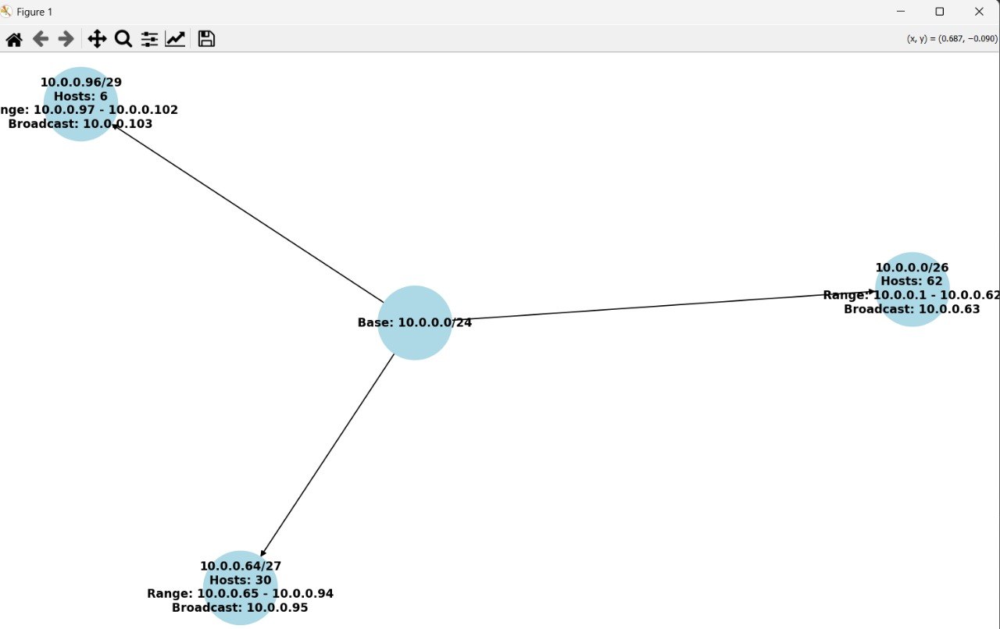

# 🧮 Subnetting Automation in Python

[](https://www.python.org/)
[](LICENSE)
[](https://en.wikipedia.org/wiki/Subnetwork)
[](https://github.com/ZiyadAzzaz)

A powerful and educational Python project to **automate subnetting**, allocate IP ranges dynamically based on host needs, and **visualize network topology** using interactive graphs.

This tool is ideal for:
- 📘 Networking students  
- 🧑‍💻 Systems engineers  
- 👨‍🏫 Lab instructors  
- ⚙️ Anyone needing fast and accurate subnet breakdowns  

---

## 🚀 Key Features

- 🔢 Dynamic subnet allocation based on host requirements  
- 🧮 CIDR prefix calculation using binary logic  
- 📋 Displays:
  - Usable host range  
  - Subnet mask (decimal + binary)  
  - Broadcast address  
  - Network address (binary)  
- 📈 Network topology visualization with `networkx` and `matplotlib`  
- 💬 Interactive CLI input with full validation  
- ❌ Handles edge cases like /31 and /32 correctly  

---

## 🛠️ Usage

### ▶️ Run:
```bash
python3 subnetting.py
```

### 👤 Input:
- Base CIDR block: e.g. `192.168.0.0/24`  
- Host requirements: e.g. `100, 50, 20`

---

## 📦 Requirements

Install dependencies:
```bash
pip install networkx matplotlib
```

> Uses built-in module: `ipaddress`  
> Tested on Python 3.8+

---

## 📊 Sample Output

```
Subnet 1: 192.168.0.0/25
Usable Hosts: 126
Range: 192.168.0.1 - 192.168.0.126
Broadcast: 192.168.0.127
...
```

🖼️ A network topology graph will be displayed as a tree.




---

## 🧠 Learning Objectives

- Understand how subnet sizes are calculated  
- Visualize IP address allocation in binary and decimal  
- Strengthen grasp of CIDR, IP ranges, and subnetting logic  
- Practice interactive scripting and graph generation

---

## 🧪 How It Works

1. Sorts host needs in descending order  
2. Converts each need to minimum viable CIDR prefix  
3. Allocates subnets within the base network block  
4. Prints subnet info and binary representations  
5. Uses `networkx` to plot a topology tree

👉 [View the complete source code](https://github.com/ZiyadAzzaz/subnetting-automation/blob/main/subnetting-automation.py)

---

## 📁 Project Structure

```
subnetting-automation/
├── subnetting.py       # Main script
├── README.md           # This file
```

---

## 📈 Future Enhancements

- [ ] Export subnet data to CSV or JSON  
- [ ] Save graphs as PNG or SVG  
- [ ] Add non-interactive CLI flags (`--base`, `--hosts`)  
- [ ] Detect overlapping subnets  
- [ ] Add GUI with Flask or Streamlit

---

## 👨‍💻 Author

**Ziyad Azzaz**  
AI & Robotics Engineer
GitHub: [Ziyad Azzaz](https://github.com/ZiyadAzzaz)

---

## 📜 License

This project is licensed under the **MIT License**.  
You are free to use, modify, and share it with attribution.
